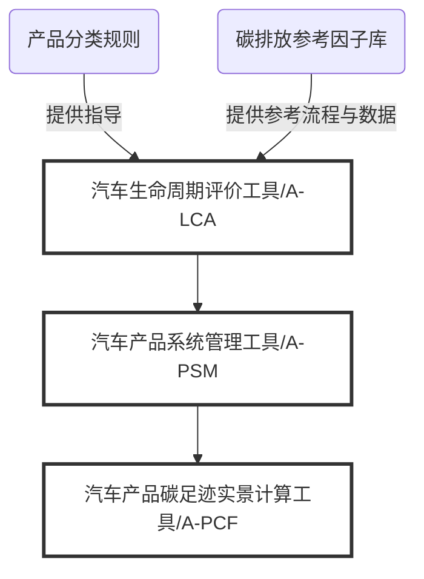

# 关于AICP产品碳足迹系列工具

## 概念与术语

**产品碳足迹：**
来自定义Product Carbon Footprint(PCF)或Carbon Footprint of Products(CFP)。产品碳足迹是指衡量某个产品在其生命周期各阶段的温室气体排放量的总和。例如，从原材料开采、产品生产、运输、销售、使用、处置/回收等多个阶段的各种温室气体排放的累加。产品碳足迹可以帮助评价和核算产品的能源消耗及其环境影响。

**二氧化碳当量：**
二氧化碳当量(CO₂e)是AICP评价产品碳足迹最终量化结果的标准单位。产品所产生的温室气体排放可能包括二氧化碳、甲烷、氮氧化物、氢氟碳化合物等多种气体类型，而二氧化碳当量是将产品碳足迹核算过程中量化得到的所有温室气体排放量依据100年全球增温潜势(GWP100a)折算得到的等效到二氧化碳排放量，以便于在不同产品间进行分析和比较。

**生命周期评价：**
生命周期评价(Life Cycle Assessment)是一种衡量和评价产品在其生命周期内造成环境影响的方法。对目标产品实施LCA分析是量化其产品碳足迹的一个重要基础。

**产品系统：**
产品系统(Product System)是具有一种或多种特定功能、并能模拟产品生命周期的单元过程的集合。

**实景数据：**
指目标产品的具体目标批次在其真实的生命周期活动中所产生的数据。实景数据是一种高质量的原始数据，使得产品碳足迹的计算结果能够更准确反映其对应产品批次的真实生命周期活动。

## 标准依据

ISO 14067:2018 温室气体产品碳足迹量化要求和指南

IPCC 2.10.2 Direct Global Warming Potentials

## 指导原则

AICP对于平台用户参与产品碳足迹核算、使用相关辅助工具等相关活动，总体将遵循以下指导原则展开。

**责任制**
AICP对其上所有产品碳足迹的结果、数据与流程记录均拥有严格的保管责任，进而确保这些信息是具有良好的可追溯性。

**一致性**
AICP的重要工作使命是推动汽车行业以一致、规范的方式实施量化和管理产品碳足迹的活动，并促使这些活动的产物获得充分的可比性与可信度。

**供应链协作**
帮助汽车供应链以紧密协作的方式实施产品碳足迹相关的活动是AICP的重要设计导向。AICP用户将会受益于更广泛和深入的供应链参与程度。

## 了解AICP产品碳足迹系列工具

AICP为用户提供了三项产品碳足迹相关工具：

- 汽车生命周期评价工具(A-LCA)
- 汽车产品系统管理工具(A-PSM)
- 汽车产品碳足迹实景计算工具(A-PCF)

以及一项第三方验证辅助模块：

- 验证管理

帮助用户完成产品碳足迹相关的量化、管理、第三方验证工作，并保证这些工作的结果满足责任制、一致性和供应链协作三大原则。

### 汽车生命周期评价工具(A-LCA)

该工具可用于帮助用户完成对目标产品的LCA建模与分析工作。

该工具提供了本地客户端软件（支持macOS以及Windows）、云端（目前尚未支持）两种使用形式。

该工具的建模结果可通过“产品系统”文件的形式导出，并导入到“汽车产品系统管理工具(A-PSM)”进行下一步的管理和维护工作。

为保证汽车行业用户以一致、科学、适合行业特征与需求的方式量化产品碳足迹，该工具通过内置数据或参数的方式指定了LCA过程涉及的相关方法以及参考数据库：

1. 第三方碳排放参考数据库（或称为LCI数据库）：Ecoinvent LCI Database。
2. LCIA Method（生命周期环境影响评价方法）：IPCC 2021。
3. LCIA Category（对应于生命周期环境影响评价方法的环境影响类型及其特征化因子）：IPCC 2021 GWP 100。

AICP将根据汽车行业碳活动的实践与积累，不断更新、调整和优化产品碳足迹相关的要求、规范或参考，使得汽车生命周期评价工具更加适合于汽车行业量化产品碳足迹的业务特征和需求。

### 汽车产品系统管理工具(A-PSM)

该工具的基础功能是帮助用户管理和维护其为目标产品建立的“产品碳足迹模型”。具体形式上，“产品碳足迹模型”指通过“汽车生命周期评价工具(A-LCA)”所产出的相关产品系统文件。为保持描述的一致性与严谨性，AICP平台均以“产品系统”一词指代上述模型。

产品系统是基于目标产品的设计文件与实际工艺流程所产出的生命周期评价建模，得以反映该产品在其生命周期内对环境产生的影响。产品系统应当代表具有一种或多种特定功能、并能模拟产品生命周期的单元过程的集合。

在“汽车产品系统管理工具(A-PSM)”中所维护的产品系统并不一定能够直接计算得到该产品下具体批次的产品碳足迹结果，这是因为产品系统缺乏对应批次的目标产品在生产或其他生命周期过程中的“实景数据”输入。例如，产品运输环节中的实际燃料消耗量随不同批次的运输情况而变化，则该数据需要在后续的“汽车产品碳足迹实景计算工具(A-PCF)”中输入到产品系统，方能得到最终对应该批次的产品碳足迹结果数据。

该工具的具体功能是维护用户针对其目标产品建立的产品系统（可以理解为“产品碳足迹模型”）。产品系统应当反映产品的实际生命周期活动的事实，并包含全部生命周期阶段（包括使用和回收阶段）。

该工具会记录和维护产品系统的更新记录。AICP平台内所有碳足迹计算结果都可以追溯到用于计算该碳足迹结果的产品系统。

### 汽车产品碳足迹实景计算工具(A-PCF)

该工具的功能是基于“产品系统”以及真实生产批次对应的“实景数据”作为输入，计算目标产品的碳足迹结果数据，并生成计算报告。

该工具会保存维护目标产品、目标批次的碳足迹结果数据，以及为计算此数据所输入的“产品系统”与“实景数据”的原始信息。因此，每一批产品的碳足迹数据都可以追溯到原始输入信息。

AICP为基于“实景数据”的长期碳足迹量化与管理提供了相应支持，使得用户能够向计算引擎提供对应具体产品批次的真实生产数据（例如耗电量、运输距离等）并将这些数据应用于对应产品批次的碳足迹计算。理论上，“产品系统”直接反映了目标产品的设计流程、而“实景数据”直接反映了每批次的实际生产数据。尽可能地使用“实景数据”有助于提高产品碳足迹的数据质量与可信度。

在整合供应链上游的产品碳足迹数据后，AICP还可基于目标产品的BOM信息，引用上游零部件中已经在AICP已经存在碳足迹模型或数据的相关信息，并计入目标产品的碳足迹计算结果。

### 验证管理模块

该模块是AICP平台提供的第三方验证功能，帮助用户基于已经产生的碳足迹结果形成一个第三方验证记录。

该模块支持用户直接引用一项已经产生的、针对特定产品批次的碳足迹结果，并上传与该结果相关的支持性材料（文档、媒体文件等），以形成一个待验证项。

该模块支持用户将待验证项授权给第三方验证方用户查看并验证碳足迹结果。例如，用户可以将他的某一项产品碳足迹结果连同《盘查报告》以及相关支持性材料授权给第三方认证机构进行查验。获取授权的第三方认证机构有权在授权范围内查验用户的待验证项内容，但无权更改待验证项本身的内容。

获取授权的第三方认证机构可以在完成在线数据、材料、文档的查验，以及相匹配的线下核查工作后，在待验证项中变更验证状态，并上传相应的《核查报告》或其他适用的验证文档。

